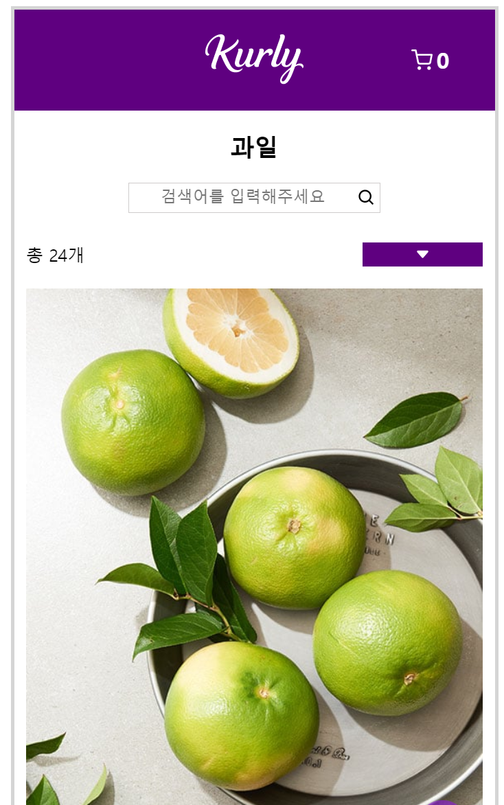

# Redux Project

## About This Project
  Redux를 사용하여 만든 페이지입니다. 
  상품을 장바구니에 추가할 수 있고 원하는 상품을 검색창에 입력하여 찾아볼 수도 있습니다. 
  장바구니에서는 추가된 상품을 삭제할 수 있으며 상품 수량도 선택할 수 있습니다. 

  ## Stacks
  
  
  
    
    

  ## Skill
  <a
  href="https://drive.google.com/file/d/1tIQqg1uia2jKuvV8fUXuGzBsxpXFmPdG/view?usp=share_link"
  target="_blank">
  기능 설명 보러 가기(Click)
  </a>
